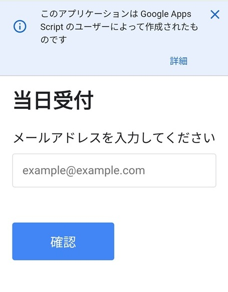

# JSMBEQ 2026

## 時系列やること

### 7-14日前の作業：人数がだいたいわかる、演題が決まる=座長等決める

- お菓子を買う：日曜日見に行く
- 2Lのお茶等買う：業務スーパー、トライアル、ホムセン等が安い
  - 量は2L×10本(300ml×60名=18L)を想定：お茶3(min 140yen), 紅茶3, オレンジ 3, ポカリ 1(min 200yen)
  - 紙コップ 100-120 
- [消耗品](#必要物品)：ボールペン、マジックペン、フォトスタンド×4、ゴミ袋etc
- 500mLのお茶60-72yen/本 (通販が安い)
- 座長、評価者、演者に確認：pdf送付、発表の流れの確認をメール
- 抄録送付(pdf)
- [雇用契約書](./media/学会補助員雇用契約書.pdf)、[送金口座登録書](./media/支払に伴う個人情報申告書(アルバイトなど年間5万以下).docx)の印刷、

### 1-7日前の作業

- ネームカード印刷
- A4、A3印刷
- [両替](#必要物品)：5万円程度-お釣り用
- [物品確認](#必要物品)
  - フォトスタンド、QRコードetc

#### 1日前

- 会場確認
  - 部屋の貼り紙、(あれば)立て看板の貼り紙
  - WIFI接続設定
  - 受付、記名台、お菓子、お茶置き場
  - ゴミ捨て段取り
  - 印刷段取り
  
- 物品確認
  - ネームカード事前発行分
  - ネームカード当日発行分(白紙)
  - ネームホルダー：新規購入 100
  - [現金](#必要物品)：5万円程度-お釣り用
    - 5,000円, 1000円, 500円, 100円
  - 参加者一覧表：A4印刷
  - QRコード：
    - 受付：参加者リスト、参加者受付、抄録
    - 記名台(フォトスタンド 3個)：参加者受付、抄録

### 当日の作業

#### [受付作業](./reception.md)urlのQRコードを用意して受付スタッフが参照できるようにする。

- 受付係
  - ipad(要wifi)で参加者リストを出す
    - QRコードですぐ復帰できるよう

- 参加者
  - 事前受付ありなし、いずれもgoogleフォームにメアド入力 -> 名前と金額確認 -> 受付に提示
    
    - 事前登録あれば名前と金額を表示
    - 事前登録なしは名前、所属、学会会員/非会員/学生の選択 

## 費用：ざっくり

- 会場費：8万
- お菓子、お茶：1.8万(300円×60名)
- 弁当：4.8万 (800:弁当700+お茶100 ×60名)
- アルバイト: 5.4万(0.9万×6名)
- 消耗品：1万(ネームホルダー 0.5, 紙0.1, ペン、フォトスタンド、テープ、ゴミ袋etc)

## 必要物品

- 受付、記名台
  - ipad x2
  - ノートPC：集計等-python導入し動作確認
  - ノート1、ボールペン2、マジックペン1：受付用
  - ネームカード、ネームホルダー済み
  - ボールペン5、マジックペン3、ペン立て1+文房具入れる袋：記名台用
  - フォトスタンド：QRコードを立てる 3台くらい- 100均で買える
  - セロテープ2本：受付、2F
  - ガムテープか養生テープ
  - バイト契約書6+1予備
  - 現金用袋
    - お札
    - 小銭入れ
  - お釣り用現金：50,000円くらい? 非会員(お釣り要700円)10名を想定
    - 5,000円：4枚 20,000
    - 1,000円：23枚 23,000
    - 500円：10枚 5,000
    - 100円：20枚 2,000
  - ゴミ袋45-90L
  - コピー用紙：メッセージ用10－20枚
  - QRコード
    - 受付：参加者リストのgoogleスプレッドシート、参加者受付、抄録pdf、受付マニュアル
    - 記名台(フォトスタンド 3個): 参加者受付、抄録
  - 「受付」の紙 A4
  - 抄録集(プログラム)：座長用+評価者用を印刷(14プラス5=20ほど)
  - 評価用用紙：評価者全員分
  - 参加者一覧：トラブル対応用

- 立て看板
  - 「2026 日本生体医工学会九州支部学術大会会場」:A3×2

- 各会場
  - 部屋の表示(A-C会場)：A3
  - 座長、演者貼り紙: A4
  - マイク(2 or 3本)：B,C会場は2本しかない
  - 評価用紙: QRコード、演者番号、筆頭演者、タイトルのリスト

- [お菓子、ドリンク、紙orプラスチックコップ](#7-14日前の作業)
- [弁当+500mlお茶](#7-14日前の作業)

## 座長への案内

- 当日
  - 時間：14+4分(2分交代)
  - 抄録集プリント

## 評価者への案内

- 当日
  - googleフォームのQRコード+説明の用紙を渡す

## 今後の提案

- paypay支払い

## 追記：[デジタル化の工夫](./dx.md)

## トラブル

### マイナーなもの

- 会場にマイクが2本しかないところがあった。座長のマイクを使いまわし