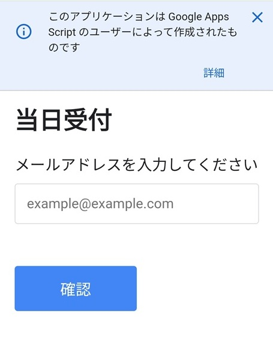

# JSMBEQ 2026

## todo

- 当日受付オペレーション改善
  - メアド->名前でマッチ
  - 演題登録あり、参加登録なしの対応
  - 次は必要
    - 領収書控え入れ：郵便箱的なのがベター
    - 文房具にはさみ
    - 手書き領収書 会員が不足10枚->20枚
    - 受付机は２人掛け6 (受付1、入出金1、ネームカード2, 物置き1、記名台1)
- 事前参加登録
  - 重複登録除外
  - JotFormの利用
- 領収書はミシン目入り用紙を使用する
  - 100枚は必要: 事前60、当日会員20、非会員10、学生10

## 時系列やること

### 7-14日前の作業：人数がだいたいわかる、演題が決まる=座長等決める

- お菓子を買う：日曜日見に行く-> ネットで注文した
- 2Lのお茶等買う：業務スーパー、トライアル、ホムセン等が安い
  - 量は2L×10本(300ml×60名=18L)を想定：お茶3(min 140yen), 紅茶3, オレンジ 3, ポカリ 1(min 200yen)
  - 紙コップ 100-120
- [消耗品](#必要物品)：ボールペン、マジックペン、フォトスタンド×4、ゴミ袋etc
- 500mLのお茶60-72yen/本 (通販が安い)
- 座長、評価者、演者に確認：pdf送付、発表の流れの確認をメール
- 抄録送付(pdf)

### 1-7日前の作業

- ネームカード印刷
- A4、A3印刷：案内表示板等
- 参加者リスト印刷
- [雇用契約書](./media/学会補助員雇用契約書.pdf)の印刷、[送金口座登録書](./media/支払に伴う個人情報申告書(アルバイトなど年間5万以下).docx)の作成
- [両替](#必要物品)：5万円程度-お釣り用
- [物品確認](#必要物品)
  - フォトスタンド、QRコードetc

#### 1日前

- 会場確認
  - 部屋の貼り紙、(あれば)立て看板の貼り紙
  - WIFI接続設定
  - 受付、記名台、お菓子、お茶置き場
  - ゴミ捨て段取り
  - 印刷段取り

- 物品確認
  - ネームカード事前発行分
  - ネームカード当日発行分(白紙)
  - ネームホルダー：新規購入 100
  - [現金](#必要物品)：5万円程度-お釣り用
    - 5,000円, 1000円, 500円, 100円
  - 参加者一覧表：A4印刷
  - QRコード：
    - 受付：参加者リスト、参加者受付、抄録
    - 記名台(フォトスタンド 3個)：参加者受付、抄録

### 当日の作業

#### [受付作業](./reception.md)urlのQRコードを用意して受付スタッフが参照できるようにする。

- 受付係
  - ipad(要wifi)で参加者リストを出す
    - QRコードですぐ復帰できるよう

- 参加者
  - 事前受付ありなし、いずれもgoogleフォームにメアド入力 -> 名前と金額確認 -> 受付に提示
    
    - 事前登録あれば名前と金額を表示
    - 事前登録なしは名前、所属、学会会員/非会員/学生の選択
  - 反省点
    - メアドのタイプミス?等でマッチしなかった。名前で検索がよい
    - 演題登録のみの参加者がいた

#### [会場作業](./floor.md)

## 費用：ざっくり

- 会場費：8万
- お菓子、お茶：1.8万(300円×60名): 多かった
- 弁当：4.8万 (800:弁当700+お茶100 ×60名)
- アルバイト: 5.4万(0.9万×6名)
- 消耗品：1万(ネームホルダー 0.5, 紙0.1, ペン、フォトスタンド、テープ、ゴミ袋etc)

## 必要物品

- 印刷物
  - 受付に置く
    - 領収書
      - 事前登録：あらかじめ印刷-60名分
        - 演題登録して参加登録していない参加者の取り扱い
      - 当日登録
        - 会員(3000円)、非会員(3300円)、学生非会員(3000円)を分ける
        - 会員20枚、非会員10枚、学生10枚くらいあったら足りる
        - 10枚ずつ用意して会員が不足した
    - 抄録集(プログラム)：座長用+評価者用を印刷(14プラス5=20ほど)
    - 「受付」「記名台」の紙 A4 - 依頼済
    - 評価用用紙：評価者全員分
    - 参加者一覧：トラブル対応用 - 木曜印刷
    - バイト契約書6+1予備
    - QRコード
      - 受付・会場係マニュアルリンク、参加者リスト(A4) 5枚(受付+3会場+予備)
      - 受付フォーム(写真サイズ) 2枚(記名台にも置く)
      - 抄録集(写真サイズ) 2枚(記名台にも置く)
    - 受付・会場マニュアル：6部+主要メンバー4=10くらい：会場補助員用-木曜印刷
      - 緊急連絡先含む
    - 賞状：当日印刷
  - 各会場
    - 座長、演者貼り紙: A4 3セット
    - 入口案内表示(A,B,C) 1枚ずつ-依頼済
    - 座長指示内容
  - 入口立て看板
    - 「2026 日本生体医工学会九州支部学術大会会場」:A3×2くらい-依頼済
  - ネームカード
    - ネームカードホルダー
  - お弁当：60個(事前登録分)：11時業者搬入-ケーズキッチン
  - ペットお茶：土曜日搬入

- 会長印鑑
  - 奨励賞に押印：あらかじめ印刷しておくと不要かも

- 受付、記名台
  - 受付机: ２人掛け6 (受付1、入出金1、ネームカード2, 物置き1、記名台1)
  - ipad×1：かなり役に立った
  - ノートPC：受付+ 集計-python導入し動作確認
  - ノート1、ボールペン2、マジックペン1：受付用
  - ボールペン5、マジックペン3、ペン立て1+文房具入れる袋：記名台用
  - あった方がいいかも：ゼムクリップ入れ-領収書+ネームカード+評価者用紙(評価者)+抄録集(座長、評価者)を留めるクリップを外したあと入れておく
  - ~~コピー用紙：メッセージ用10－20枚~~-不要だった
  - 付箋：5cm角くらい一束
  - ネームカード、ネームホルダー
  - フォトスタンド：QRコードを立てる 3台くらい- 100均で買える
  - セロテープ2本：受付、2F
  - ガムテープか養生テープ：受付、2F
  - ハサミ
  - 現金用袋
    - [お札いれ、小銭入れ](./media/coin_case.png)：100均
  - お釣り用現金：50,000円くらい? 非会員(お釣り要700円)10名を想定
    - 5,000円：4枚 20,000
    - 1,000円：23枚 23,000
    - 500円：10枚 5,000
    - 100円：20枚 2,000
  - ゴミ袋45-90L -> 70L×10枚を購入
  - QRコード
    - 受付：参加者リストのgoogleスプレッドシート、参加者受付、抄録pdf、受付マニュアル
    - 記名台(フォトスタンド 3個): 参加者受付、抄録

- 立て看板：会場で借りる -> なし、入口に貼り付け

- 各会場
  - 部屋の表示(A-C会場)：A3
  - 座長、演者貼り紙: A4
  - 座長席：[座長への案内](./media/instruction_to_chair.pdf)
  - マイク(2 or 3本)：B,C会場は2本しかない
  - レーザーポインタ：あれば

- [お菓子、ドリンク、紙orプラスチックコップ](#7-14日前の作業)
  - [お菓子一覧](./media/snacks.png)
    - 1.2万円分@amazon
    - 量は多かった: 8000-9000円分でよさそう
    - ハッピーターンは湿気が来やすいので、しっかり個包装がよさそう
    - 柿の種は大量に余っていた
  - ドリンク:1.5-2L×10本(お茶3, ストレートティー2, ミルクティー1、オレンジ3、アクエリアス1)
    - オレンジが2本、アクエリアス1本、お茶1本余り
  - コップ：プラスチックタイプ220mL×100個購入
    - 30くらい余った

- [弁当+500mlお茶](#7-14日前の作業)
  - 2026年は[くるめし弁当](https://www.kurumesi-bentou.com/)よりケーズキッチンを利用
  - 1人700円：チキン南蛮、とんかつ、ハンバーグ
    - チキン南蛮の減りが早かった
  - 60名分で注文：参加60名、事前登録以外にも配布したが6個くらい余り
  - お茶72本(24本3ケース)購入：10本余り

## 座長への案内

- 当日
  - 時間：14+4分(2分交代)等案内
  - 抄録集プリント

## 評価者への案内

- 当日
  - googleフォームのQRコード+説明の用紙を渡す

## 今後の提案

- paypay支払い

## 追記：[デジタル化の工夫](./dx.md)

## トラブル

### マイナーなもの

- 会場にマイクが2本しかないところがあった。座長のマイクを使いまわ
