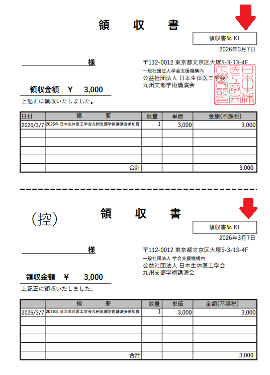

# 受付作業

## 概要

- 事前登録、当日登録の2種類があります。当日登録は??番以上の[登録番号](./media/registration_done_plus_mark.jpg)になっています。また「事前登録」でなく「当日受付」のタイトルがついていますので、必要に応じてスクロール、確認してください。
- 参加料受け取り、ネームカードのお渡しをお願いします。
  - 事前登録は**印刷済みのネームカードと領収書**
  - 当日登録は**白紙のネームカードと領収書**
- 受付作業はipad(のgoogleスプレッドシート)上で行います。一応googleスプレッドシートのurlを受付に置きますので、ipadの不調などの際はスマホで開いてみてください。

## 参加者受付

- 受付：事前登録/当日登録いずれの場合も参加者が名前、金額を示した以下のような画面を提示しますので、金額を受け取ってください。
  - [参加者受付済画面](./media/registration_done.jpg)
- 参加費受け取り：3,000円と3,300円の2パターンあります。適切に入出金お願いします。
- 入金確認：ipad(googleスプレッドシート)で登録番号を頼りに参加者を同定して「参加費入金」チェックを入れてください
  - [受付完了画面](./media/checkbox_done.png)
- ネームカードお渡し
  - 登録番号を頼りにネームカードと領収書をお渡しください

### 注意点

- 当日参加登録は??番以上の[登録番号](./media/registration_done_plus_mark.jpg)がついています。また「当日受付」と上のほうにタイトルをつけています。
  - 名前のないネームカードを渡す
  - 対応する領収書(会員/非会員/学生)で登録番号(矢印部分の2箇所)を書いて渡してください。
  - 

- トラブル
  - 参加者が「事前参加したのに当日参加になった」と言われたら
    - ipad(googleスプレッドシート)名前を参照して探してみてください。メアドが事前登録と違っていると当日受付扱いになります。
      - もし事前登録の表で見つかったらそちらでipadのチェック+ネームカード、領収書のお渡しお願いします。
    - 料金は特に変わらないので、どうしても見つからない場合は当日受付扱いで処理してください。
  - ipadが切れたら
    - とりあえず参加者の**登録番号**をメモ等して残してください。
      - 

