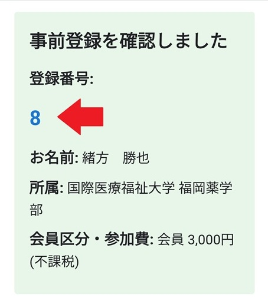
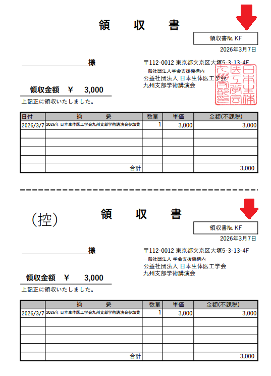

# 受付作業

## 小さな問題たち

- 当日入力：会員で入力しているが、領収書が非会員になっていた：入金総額から非会員で処理したと判定
- メアドのタイプミス?で事前登録がマッチせず当日登録になった
- 受付処理のチェックがないが、領収書の控えが1つ入っていた-入金総額が合わないので受付してないと判定
- 当日受付の会員の領収書が不足した
- 領収書の会員(KF)/非会員(KKC)/学生(KKS)の違いがわかりにくい

## 概要

- 参加費受け取り：参加者がスマホで提示します
  - 3,000円 or 3,300円の2パターンです。
- ネームカードと領収書のお渡し：事前登録者と当日登録者の2パターンがあります。
  - 事前登録は**印刷済みのネームカードと領収書**
  - 当日登録は**白紙のネームカードと領収書**
    - 領収書には名前と登録番号を記入後に渡してください

- 事前登録、当日登録の区別：当日登録は**57番**以上の登録番号になっています。
 
  - また「事前登録」でなく「当日受付」のタイトルがついています。必要時は参加者のスマホをスクロールしてもらって確認してください。
- 座長・評価者は追加のお渡しあり
  - 座長：プログラム抄録集
  - 評価者；プログラム抄録集+評価用紙
- 受付完了の入力
  - PCかipad(のgoogleスプレッドシート)上で行います。一応googleスプレッドシートのurlを受付に用意します。
    - PC/ipadの不調などの際はスマホで開いてみてください。
    - それでもうまく行かない時は紙に登録番号をメモするだけでもよいです。

## 参加者受付

- 受付：事前登録/当日登録いずれの場合も参加者が名前、金額を示した以下のような画面を提示しますので、金額を受け取ってください。
  - [参加者受付済画面](./media/registration_done.jpg)
- 参加費受け取り：3,000円と3,300円の2パターンあります。適切に入出金お願いします。
- ネームカードお渡し
  - 登録番号を頼りにネームカードと領収書をお渡しください
- 入金確認入力：ipad(googleスプレッドシート)で登録番号(スプレッドシート上では領収書番号)を頼りに参加者を同定して「参加費入金」チェックを入れてください
  - [受付完了画面](./media/checkbox_done.png)
  - トラブってどうしようもない時は登録番号をメモするなどしておいてください。
- 座長、評価者に渡す追加物品
  - 座長/評価者両方：印刷のプログラム抄録集
  - 評価者：評価用用紙(A4の紙：QRコードと名前を確認)

## 弁当受け取り

- お弁当を当日受け取りお願いします。11時ごろお願いしています。
- ペットボトル500mLのお茶は別途用意しています。箱から出して持っていけるようにしてください。
- 午前のセッションが終わったら取りに来ると思います。
  - 事前受付(印刷したネームカード)の人に弁当+お茶を渡してください。
  - 余裕があれば当日受付の人にも渡してもらってよいです。
    - 午前の受付人数(受付の表からわかると思います)をみて決めましょう
  - 全部で60ほど用意しています。

### 注意点

- 当日参加登録は**57番**以上の登録番号がついています。また「事前登録」でなく「当日受付」と上のほうにタイトルをつけています。
  
  - 名前のないネームカードを渡す
  - 対応する領収書(会員/非会員/学生)で矢印部分の2箇所に登録番号を記入して渡してください。
  - 

- トラブル
  - **参加者が「事前参加したのに当日参加になった」と言われたら** これが多かった
    - ipad(googleスプレッドシート)名前を参照して探してみてください。~~メアド~~(名前に変更する)が事前登録と違っていると当日受付扱いになります。
      - もし事前登録の表で見つかったらそちらでipadのチェック+ネームカード、領収書のお渡しお願いします。
    - 料金は特に変わらないので、どうしても見つからない場合は当日受付扱いで処理してください。
  - 「受付画面が出ない」と言われたら
    - 受付スタッフが代行を試みてください。うまく行かない場合は名前を控えるなどでノートに記録を残してください。
    - 金額は非会員は3,300円、会員もしくは学生は3,000円になります。
  - PCのネットが切れたら
    - とりあえず参加者の**登録番号**をメモ等して残してください。
      - 
